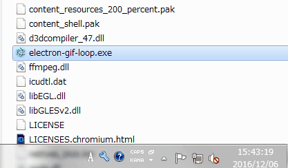

# electron-gif-loop

# 特徴

最低1ループはアニメーションを見せる、gifビューワーです。

* [GIPHY] からgitを取得し続けます。
* 任意のタグを複数登録することで、好きなジャンルのgifを表示できます。(精度は[GIPHY]APIに依存します)
* 可能な限り、ループの終了直後に次の画像を表示します。
* 画面のリサイズが可能です。
* 常に前面表示の切り替えが可能です。

# デモ

# 動作検証環境

* Windows7 64bit

# 動作方法

ダウンロードしたディレクトリ内のexeファイルを起動します。

# 終了方法

タスクトレイを右クリックし、`exit`を選択します。

# アンインストール方法

ダウンロードしたディレクトリをそのまま削除したあと、Windws7の場合は　　
`C:\Users\%USERNAME%\AppData\Roaming\electron-gif-loop\`　　
を削除して下さい。

# その他

* 短いループ画像、例えばシネマグラフなどには向きません。
* 巨大なgifファイルを取得した場合、一時的にメモリ使用量が増大します。
* 次のgifまでのループ時間は、次のgifの処理時間に依存します。

# 予定および願望

* 最低ループ時間設定
* 画面右クリックによるコンテキストメニュー実装
* 処理負荷軽減
* スムーズな切り替え処理
* 静止画に対応
* その他の画像APIとの連携
* オフラインモード
* 画像フォルダのD&Dによる動作

[GIPHY]:http://giphy.com/